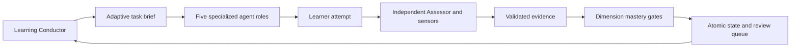

# AI-LC — AI Learning Lifecycle

AI-LC is an evidence-driven framework for adaptive technical learning. It decides what
a learner should do next from prerequisites, demonstrated dimensions, misconceptions and
reviews due. It is a learning lifecycle engine, not a static course or exercise bank.

Version 0.1 supplies a Python CLI, deterministic core and instructions for an external AI
harness. The harness performs teaching and just-in-time exercise generation. No API key,
model SDK, web server or autonomous chat runtime is required.

## Installation

Python 3.12+ and [uv](https://docs.astral.sh/uv/) are required for the recommended workflow.
From this checkout:

```sh
uv sync
uv run ailearn --help
uv tool install .
```

The distribution is `ai-learning-lifecycle`; the executable is `ailearn`. The package has
not been published to PyPI. The source repository is
[Moraw1993/AI-LC](https://github.com/Moraw1993/AI-LC). For the development branch:

```sh
uv tool install git+https://github.com/Moraw1993/AI-LC.git@develop
```

This repository is exclusively for implementation and development. Initialize learner
workspaces in a separate directory outside the checkout.

## Quick start

In an empty learning directory outside this checkout, using the installed tool:

```sh
ailearn init
```

Open that directory in Codex and invoke **`$ai-lc-master`**. Master discusses what you
want to learn, why, the abilities you want to achieve, your previous experience, language,
pace and style. Together you choose the tutor's display name and course workspace name.
Initialization chooses **no subject, level or learning path**.

The neutral hub contains `.ai-learning/bootstrap.json`, six role instructions, shared
policy and six discoverable skills under `.agents/skills`. Codex discovers skills from
that directory; see [official skill documentation](https://learn.chatgpt.com/docs/build-skills).
AI-LC supplies logical roles and skills, not a native Codex agent registration or model
runtime. The tutor's chosen name lives in the agreed profile.

Master prepares an explicit profile and, if necessary, a new domain pack. It invokes
`ailearn configure profile.json [--packs packs]`, creating `workspaces/<agreed-name>`.
Teacher then gathers relevant prerequisite knowledge and current ability through small
diagnostics; independent Assessor records genuine answers. A failed answer such as
"I don't know" establishes a gap, not mastery. Explaining the answer switches to teaching;
that attempt cannot be counted as independent.

Only after `ailearn complete-intake baseline.json` verifies diagnostic coverage can the
Curriculum Architect build a lesson roadmap. Master then uses `ailearn plan` and `session`.
Starter packs are optional examples; the external AI can author validated packs for other
subjects. The lesson sequence adapts to evidence, prerequisites and the agreed goal.

Root `AGENTS.md` is created only if absent. When instructions already exist, load
`.ai-learning/AGENTS.md` explicitly in the harness. Reinitializing preserves progress.
An identical course profile preserves its state; changing an existing profile or its
packs fails safely. Use a new workspace name for a different course.

Use `ailearn --workspace /path/to/learning COMMAND` to address another directory.
Hub commands route to its active course; `status` includes that course's path. After failure,
the next task becomes remediation. After sufficient independent evidence, the roadmap
advances. Due reviews preempt new material; transfer tasks follow the core gates.

## Agent interaction and an example session

The Learning Conductor reads the task brief and delegates to Curriculum Architect,
Teacher, Lab Coach, Assessor or Research & Data. Assessor receives limited teaching context.
The learner attempts first; hints progress from conceptual direction to a full solution.
The actual hint level is recorded, and hinted attempts cannot pass mastery gates.

Teacher uses `$ai-lc-diagnose`, `$ai-lc-materials`, `$ai-lc-visualize` and `$ai-lc-motion`:
baseline checks, sourced educational notes, data plots/diagrams/generated illustrations,
and animated explanations or motion-design videos. Image and video rendering depend on
the harness's available tools; the skills do not install services. When a video renderer
is unavailable, use a standalone HTML animation or an explicitly labeled storyboard.

Lab Coach uses `$ai-lc-python-lab` and `ailearn exercise spec.json` to create fresh tasks
of at most 80 lines, including instructions. Each attempt has its own file, for example
`lessons/lesson_001_topic_002_attempt_003_statistics_mean.py`. Existing attempts are never
overwritten. The returned ID, such as `L001-T002-A003`, and path are required for modern
course implementation evidence. The CLI validates syntax and saves the scaffold; it
never executes learner code. No static exercise bank is supplied.

For time series, the prerequisite closure includes mean, variance, covariance and
correlation. If a diagnostic reveals weak covariance interpretation, the Conductor routes
Teacher and Lab Coach to covariance. Assessor separately evaluates the learner's artifact.
Two independent passing attempts for each required dimension permit progression back
toward autocorrelation. See [the runnable example](examples/time_series.py).

Assessor produces JSON matching `ailearn.models.Evidence`. Print its complete contract with:

```sh
uv run python -c "import json; from ailearn.models import Evidence; print(json.dumps(Evidence.model_json_schema(), indent=2))"
```

An example of one independent result (not enough alone for mastery):

```json
{
  "id": "covariance-interpretation-1",
  "attempt_id": "unseen-scatterplot-1",
  "competency": "statistics.covariance",
  "dimension": "interpretation",
  "score": 3,
  "independent": true,
  "hints": 0,
  "confidence": 0.9,
  "assessor": "external-independent-assessor",
  "artifact": "answers/scatterplot-1.md",
  "kind": "assessment",
  "notes": "Correct sign, units and limitation; no causal claim."
}
```

```sh
ailearn record result.json
ailearn status
ailearn session
```

Results are trusted assessor submissions; AI-LC does not authenticate assessor identity or
verify answer semantics. Modern implementation submissions must match a registered task;
the CLI also checks registered files exist. Preserve other referenced artifacts yourself.

## CLI

| Command | Purpose |
| --- | --- |
| `init` | Install a subject-neutral hub, Master and teaching skills |
| `configure FILE --packs DIR` | Create/activate a course from an explicitly agreed profile |
| `complete-intake FILE` | Confirm baseline summary and genuine diagnostic evidence IDs |
| `exercise FILE` | Register a fresh short Python task with lesson/topic/attempt numbers |
| `domains` | List validated built-in domains |
| `status` | Show dimension levels, stages, misconceptions and next action |
| `plan` | Recompute target dependency closure and readiness |
| `session --scope SCOPE` | Save a task brief for the harness |
| `record FILE --sensors FILE` | Validate evidence; optionally run fresh deterministic checks |
| `doctor` | Validate schema, DAG and evidence replay |
| `history` | Read session and evidence audit events |
| `export --evidence-jsonl` | Print full portable state or evidence lines |
| `sensors FILE` | Run structured checks without executing code |
| `sources` | List official dataset entry points |

Scopes: learn, deep-learn, review, remediate, practice, assessment, project, explore.
Explicit scope selection does not bypass prerequisite routing. Explore permits exposure
but rejects mastery-producing submissions until a new assessment session starts.

## Architecture and policy



Mastery dimensions are conceptual, mathematical, implementation, interpretation, debugging,
transfer and retention. Minimal depth requires conceptual and interpretation; standard adds
mathematical and implementation; comprehensive adds debugging. Transfer and retention are
separate later gates. Core gates require two distinct attempts, score ≥ pack threshold,
confidence ≥ 0.8, independence, no hints and no failing sensors or active misconceptions.
Failed independent evidence resets accumulated success in that dimension; failed delayed
retrieval invalidates all prior dimension passes and routes back to remediation. An explanation
or self-report can mark exposure but never mastery.

Transfer and retention evidence require core mastery first. Reviews start after the core
gate and are rescheduled after renewed mastery following failure. Dimension levels display
the last observed score; passing gates additionally check independent evidence history.

Intervals (1, 3, 7, 14, 30, 60 days) and evidence thresholds are product heuristics. Retrieval
practice motivates delayed testing; the implementation does not claim psychometric
calibration. See [architecture](docs/architecture.md), [agent model](docs/agent-model.md),
[domain authoring](docs/domain-authoring.md) and [contribution rules](CONTRIBUTING.md).

## Development and verification

```sh
uv sync
uv run pytest
uv run ruff check .
uv run ruff format --check .
uv build
uv run python examples/time_series.py
```

Starter packs cover statistics (6 competencies), machine learning (4) and time series (4).
They supply outcomes and rubrics, not exercise catalogs or an imposed subject choice.

## Existing v0.1 workspaces

Existing `.ai-learning/state.json` snapshots remain readable without rewriting or
inventing an intake baseline. Their previous evidence rules remain unchanged. The CLI's
old topic flags on `init` have been replaced by Master-led `configure`; use `init` in a
new directory for the new conversation-first flow. Re-running `init` in an old course
adds skills while preserving its snapshot and instructions. Existing conflicting skill
files fail clearly and are preserved. The internal `Store.init(Config, domains)` API
remains available for legacy integrations and the deterministic runnable example.

## v0.1 boundaries

Semantic assessment and live source discovery require an external harness. No learner-code
sandbox, automatic public-data connectors, encrypted storage, collaborative multi-user
workspace or schema migration is provided. Writer locks fail promptly and do not guess
whether a stale lock is safe to remove. If a process crashes, verify no writer is running
before removing `.ai-learning/write.lock`. JSON snapshots favor simple consistency over
large-scale storage; unsupported schemas and corrupt state fail without resetting data.

MIT licensed. Keep personal learning workspaces outside version control.
