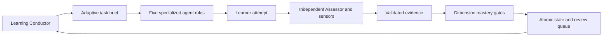

# AI-LC — AI Learning Lifecycle

AI-LC is an evidence-driven framework for adaptive technical learning. It decides what
a learner should do next from prerequisites, demonstrated dimensions, misconceptions and
reviews due. It is a learning lifecycle engine, not a static course or exercise bank.

Version 0.2 supplies a native executable and Python CLI, deterministic core and instructions for an external AI
harness. The harness performs teaching and just-in-time exercise generation. No API key,
model SDK, web server or autonomous chat runtime is required.

## Installation

Use a release installer. The installed `ailearn` executable includes Python, dependencies,
and teaching instructions, but no preset subject packs or curricula. No Python, uv, Git or
environment activation is required for release users. Install once per user and configure
each learning project.

Windows PowerShell:

```powershell
irm https://github.com/Moraw1993/AI-LC/releases/latest/download/install.ps1 | iex
```

Linux/macOS (curl and a SHA256 utility are required):

```sh
curl -fsSL https://github.com/Moraw1993/AI-LC/releases/latest/download/install.sh | sh
```

Windows puts `%LOCALAPPDATA%/AI-LC/bin` first in User PATH so it precedes older
user-installed commands. Open a new terminal and restart Codex afterwards.
Linux/macOS defaults to `~/.local/bin`; add it to PATH if needed. Downloads are checked
against the release SHA256 files before execution. Checksums detect corruption; they do
not replace trust in the release publisher. Windows x64, Linux x64/arm64 and macOS
x64/arm64 assets are built and tested on their respective runners.

To pin a release, download its installer and pass `-Version v0.2.0` on Windows, or set
`VERSION=v0.2.0` for the shell installer. Reinstalling an identical version preserves it;
a differing existing version fails. Installing a newer release switches the command,
without rewriting learning state or project instructions. Re-run project configuration;
conflicting project resources fail clearly and must be reconciled explicitly.

The older `python AI-LC-source/install.py --workspace PROJECT` path remains available
for existing integrations and requires Python 3.12+. Its project-local launcher is an
alternative; release users should use `ailearn` directly.

## Quick start

From a separate learning directory, configure Codex and check the neutral hub:

```sh
ailearn config --harness codex
ailearn status
```

Open that directory in Codex and invoke **`$ai-lc-master`**. Master discusses what you
want to learn, why, the abilities you want to achieve, your previous experience, language,
pace and style. Together you choose the tutor's display name and course workspace name.
Initialization chooses **no subject, level or learning path**.

The neutral hub contains `.ai-learning/bootstrap.json`, six role instructions, shared
policy, `.ai-learning/commands/ailearn.py` and six discoverable skills under `.agents/skills`.
Codex discovers skills from
that directory; see [official skill documentation](https://learn.chatgpt.com/docs/build-skills).
AI-LC defines provider-independent logical roles and skills. Codex setup also installs a
named Assessor profile for formal checkpoints; it does not install a model runtime. The
tutor's chosen name lives in the agreed profile.

Master prepares an explicit profile and, if necessary, a new domain pack. It invokes
`ailearn configure profile.json --packs packs`, creating
`workspaces/<agreed-name>` with its own course state. Shared roles, skills and commands
stay in the learning hub; run AI-LC commands from the hub. A course can add specific
instructions or agents when needed. Before diagnosis, Curriculum Architect prepares an
overview plan and Master presents its goal, stages, working method, projects and role
boundaries. The learner reviews it and approves the proposed version before diagnosis
begins. The plan
also recommends a versioned learning path: `focused` puts core learning before projects,
`balanced` enables projects after their approved stage, and `project-led` prioritizes an
eligible project once its competency and prerequisites are mastered. Due reviews and
remediation stay ahead of these preferences. The adaptive plan keeps the approved variant.

Teacher then gathers relevant prerequisite knowledge and current ability through the
agreed diagnostic competencies; independent Assessor records genuine answers. A failed
answer such as "I don't know" establishes a gap, not mastery. Explaining the answer
switches to teaching; that attempt cannot be counted as independent. Only after
`complete-intake baseline.json` verifies the agreed diagnostic coverage does Curriculum
Architect prepare a personalized adaptive roadmap. Master presents it and obtains approval
before the first lesson. Routine next-step changes from evidence do not require approval;
material route changes within the agreed target are versioned and require renewed approval.
Changing the target or diagnostic scope requires agreeing a new profile and course.

AI-LC ships no subject packs or sample curricula. Curriculum Architect authors and validates
a competency graph for the learner's agreed goal before course configuration. The lesson
sequence and roadmap are then adapted to diagnostic evidence, prerequisites and that goal. Run
`ailearn schema CoursePlanProposal` for the plan contract; use `ailearn plan` to inspect
plans, `ailearn plan propose FILE` to submit one, `ailearn plan approve VERSION` to approve,
and `ailearn plan revise FILE` to replace the current proposal or approved version.

Root `AGENTS.md` is created only if absent. When instructions already exist, load
`.ai-learning/AGENTS.md` explicitly in the harness. Reinitializing preserves progress.
An identical course profile preserves its state; changing an existing profile or its
packs fails safely. Use a new workspace name for a different course.

Release commands use the current directory. From elsewhere use
`ailearn --workspace /absolute/path/to/learning COMMAND` (before the command).
`config --harness codex` installs native skills, a named `.codex/agents/assessor.toml`
for completed formal assessment checkpoints, and a separate `.codex/rules/ai-lc.rules`
file allowing deterministic read commands. The Assessor profile defaults to low reasoning
and is not used for ordinary lesson replies. Existing Codex config, sandbox settings,
other permission rules and root AGENTS.md are preserved. No hooks, credentials or provider
configuration are installed. Permission rules do not grant filesystem access. The
configuration is repeatable and does not select a learning topic.

Hub commands route to its active course; `status` includes that course's path. After failure,
the next task becomes remediation. After sufficient independent evidence, the roadmap
advances. Due reviews preempt new material; transfer tasks follow the core gates.

## Agent interaction and an example session

The Learning Conductor reads the task brief and delegates to Curriculum Architect,
Teacher, Lab Coach, Assessor or Research & Data. Ordinary questions during a lesson are
formative: Teacher responds in the same conversation and does not spawn Assessor or record
Evidence. Assessor is invoked only after a learner completes a formal checkpoint listed
in the brief, such as a diagnosis, evidence-bearing attempt, project/transfer check, exam
or due retention review. The `practice` scope in a generated brief is an independent,
evidence-bearing attempt; casual practice and checks during `learn`, `deep-learn` or
`remediate` stay formative. Assessor receives limited teaching context.
The learner attempts first; hints progress from conceptual direction to a full solution.
The actual hint level is recorded, and hinted attempts cannot pass mastery gates.

Teacher uses `$ai-lc-diagnose`, `$ai-lc-materials`, `$ai-lc-visualize` and `$ai-lc-motion`:
baseline checks, sourced educational notes, data plots/diagrams/generated illustrations,
and animated explanations or motion-design videos. Image and video rendering depend on
the harness's available tools; the skills do not install services. When a video renderer
is unavailable, use a standalone HTML animation or an explicitly labeled storyboard.

Lab Coach uses `$ai-lc-python-lab` and the local `exercise spec.json` command to create fresh tasks
of at most 80 lines, including instructions. Each attempt has its own file, for example
`lessons/lesson_001_topic_002_attempt_003_course_competency.py`. Existing attempts are never
overwritten. The returned ID, such as `L001-T002-A003`, and path are required for modern
course implementation evidence. The CLI validates syntax and saves the scaffold; it
never executes learner code. No static exercise bank is supplied.

The external Curriculum Architect creates only competencies and prerequisites relevant to
the agreed goal. Master and the learner review the goal before configuration; the learner
reviews and approves both the overview and evidence-informed roadmap. No example subject,
topic sequence or exercise bank is bundled.

Assessor produces JSON matching `ailearn.models.Evidence`. Print its complete contract with:

```sh
ailearn schema Evidence
```

An example of one independent result (not enough alone for mastery):

```json
{
  "id": "outcome-interpretation-attempt-1",
  "attempt_id": "course-task-1",
  "competency": "course.outcome",
  "dimension": "interpretation",
  "score": 3,
  "independent": true,
  "hints": 0,
  "confidence": 0.9,
  "assessor": "external-independent-assessor",
  "artifact": "answers/course-task-1.md",
  "kind": "assessment",
  "notes": "Evidence tied to the agreed learning outcome and rubric."
}
```

```sh
ailearn record result.json
ailearn status
ailearn session
```

Results are trusted assessor submissions; AI-LC does not authenticate assessor identity or
verify answer semantics. Modern implementation submissions must match a registered task;
the CLI also checks registered files exist. Preserve other referenced artifacts yourself.

## CLI

Run these through `ailearn COMMAND`. Installed skills use the same executable.

| Command | Purpose |
| --- | --- |
| `init` | Install a subject-neutral hub, Master and teaching skills |
| `configure FILE --packs DIR` | Create/activate a course from an explicitly agreed profile |
| `complete-intake FILE` | Confirm baseline summary and genuine diagnostic evidence IDs |
| `exercise FILE` | Register a fresh short Python task with lesson/topic/attempt numbers |
| `domains --packs DIR` | Validate and list the agent-authored pack files in a directory |
| `status` | Show dimension levels, stages, misconceptions and next action |
| `plan` | Show approved plans, dependency closure and the next required action |
| `plan propose FILE` | Propose the overview or post-diagnosis adaptive plan |
| `plan approve VERSION` | Approve the currently proposed plan version |
| `plan revise FILE` | Replace a plan with a new version requiring approval |
| `session --scope SCOPE` | Save a task brief for the harness |
| `record FILE --sensors FILE --replace EVIDENCE_ID` | Validate evidence and optionally revise a prior judgment for the same attempt/dimension |
| `doctor` | Validate schema, DAG and evidence replay |
| `history` | Read session and evidence audit events |
| `export --evidence-jsonl` | Print full portable state or evidence lines |
| `sensors FILE` | Run structured checks without executing code |
| `sources` | List official dataset entry points |
| `schema MODEL` | Print LearningProfile, Domain, Baseline, Evidence, Exercise or Snapshot JSON schema |

Scopes: learn, deep-learn, review, remediate, practice, assessment, project, explore.
Explicit scope selection does not bypass prerequisite routing. Explore permits exposure
but rejects mastery-producing submissions until a new assessment session starts.

## Architecture and policy



Mastery dimensions are conceptual, mathematical, implementation, interpretation, debugging,
transfer and retention. Minimal depth requires conceptual and interpretation; standard adds
mathematical and implementation; comprehensive adds debugging. Transfer and retention are
separate later gates. Core gates require two distinct attempts, score ≥ pack threshold,
confidence ≥ 0.8, independence, no hints and no failing sensors or active misconceptions.
Failed independent evidence resets accumulated success in that dimension; failed delayed
retrieval invalidates all prior dimension passes and routes back to remediation. An explanation
or self-report can mark exposure but never mastery.

Evidence IDs are immutable. If an assessor corrects a judgment, submit a new evidence JSON
with a new ID and run `ailearn record corrected.json --replace OLD_EVIDENCE_ID`. The old
record remains in the audit history, while progression uses the corrected result. Ordinary
duplicate submissions remain rejected; a completed baseline cannot be revised this way.

Transfer and retention evidence require core mastery first. Reviews start after the core
gate and are rescheduled after renewed mastery following failure. Dimension levels display
the last observed score; passing gates additionally check independent evidence history.

Intervals (1, 3, 7, 14, 30, 60 days) and evidence thresholds are product heuristics. Retrieval
practice motivates delayed testing; the implementation does not claim psychometric
calibration. See [architecture](docs/architecture.md), [agent model](docs/agent-model.md),
[domain authoring](docs/domain-authoring.md) and [contribution rules](CONTRIBUTING.md).

## Development and verification

```sh
uv sync
uv run pytest
uv run ruff check .
uv run ruff format --check .
uv build
```

The wheel contains no built-in subject domains or course templates. Agents author a
course-specific competency graph from the learner's goal and validate it before use.

## Existing v0.1 workspaces

Existing `.ai-learning/state.json` snapshots remain readable without rewriting or
inventing an intake baseline. Their previous evidence rules remain unchanged. The CLI's
old topic flags on `init` have been replaced by Master-led `configure`; use `init` in a
new directory for the new conversation-first flow. Re-running `init` in an old standalone
course adds local helpers and skills while preserving its snapshot and instructions. The project
installer can attach runtime to an existing standalone course when its packaged files match; it
does not silently replace older or edited skills/commands. Existing conflicting skill
files fail clearly and are preserved. The internal `Store.init(Config, domains)` API
remains available for legacy integrations.

Keep `.ai-lc/`, `.ai-lc-install-*/`, `.ai-learning/`, learner artifacts and personal answers
out of version control. AI-LC does not rewrite an existing project's .gitignore; add these
entries yourself if the learning directory is a repository.

## v0.1 boundaries

Semantic assessment and live source discovery require an external harness. No learner-code
sandbox, automatic public-data connectors, encrypted storage, collaborative multi-user
workspace or schema migration is provided. Writer locks fail promptly and do not guess
whether a stale lock is safe to remove. If a process crashes, verify no writer is running
before removing `.ai-learning/write.lock`. JSON snapshots favor simple consistency over
large-scale storage; unsupported schemas and corrupt state fail without resetting data.

MIT licensed. Keep personal learning workspaces outside version control.
